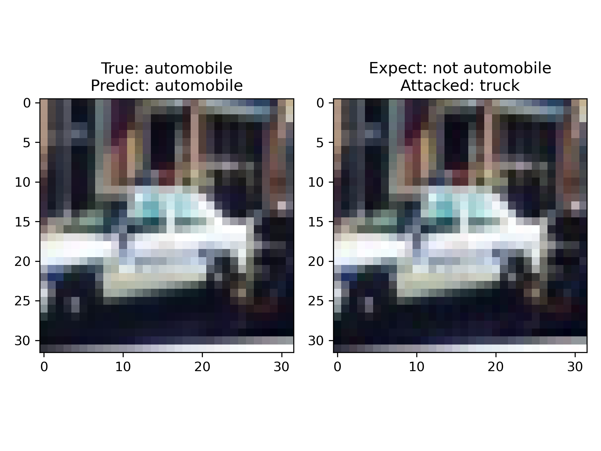
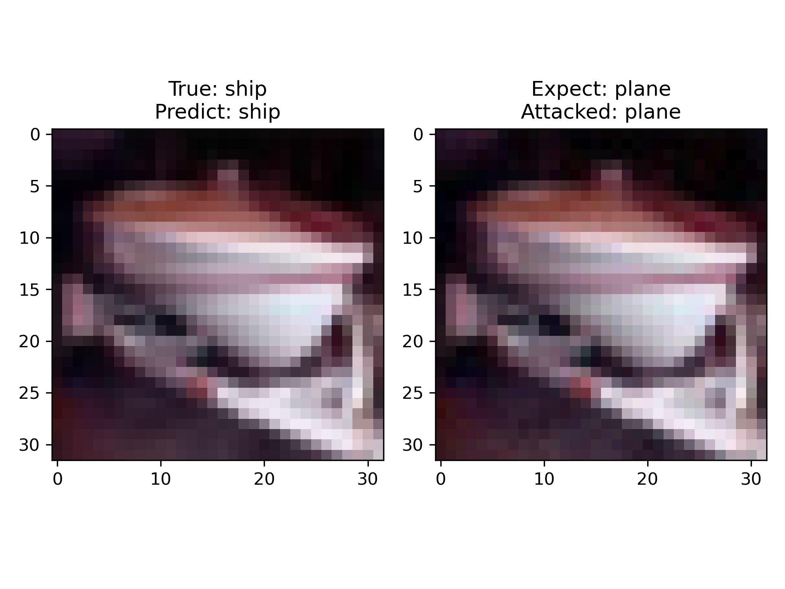
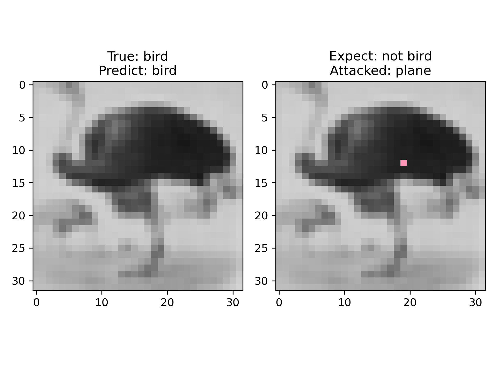
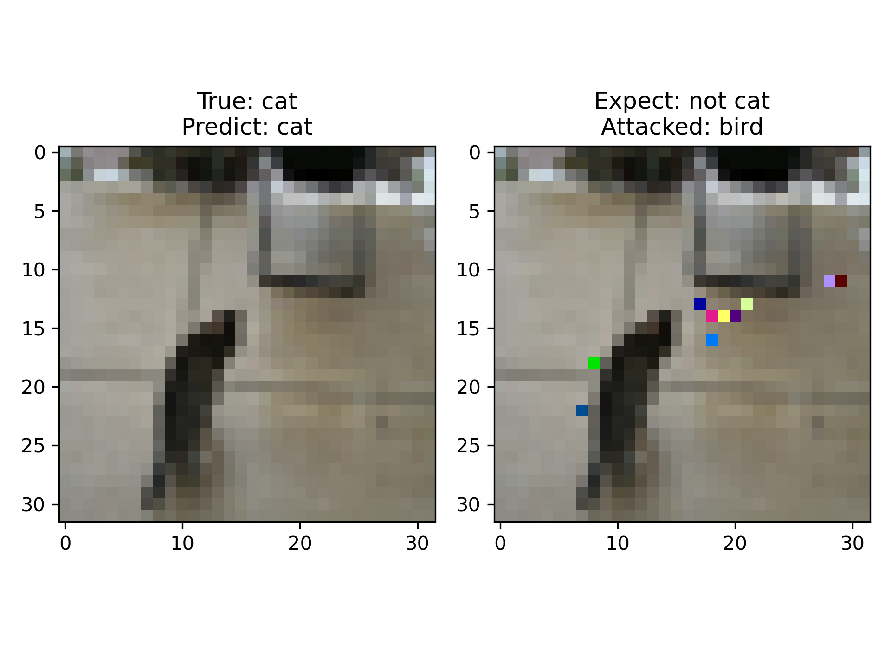

# Adversarial Attack Generation Techniques

## Introduction

Adversarial attack generation techniques for CIFAR-10 based on Pytorch: L-BFGS, FGSM, I-FGSM, MI-FGSM, DeepFool, C&W, JSMA, ONE-PIXEL, UPSET

### Examples

#### FGSM

| not targeted                             | targeted                               |
|------------------------------------------|----------------------------------------|
|  |  |

#### ONE-PIXEL

| one pixel                                     | multi pixel                                     |
|-----------------------------------------------|-------------------------------------------------|
|  |  |

#### More Examples 

More examples in [docs/assets](docs/assets)

## File overview

```
│
├── attack  # The folder that contains the attack model class
│    └── fgsm.py
│    └── ...
│
├── datasets          # Dataset folders
│    └── download.py  # A script for downloading the dataset
│
├── parameter         # Model Parameters folder
│    └── ResNet
│    │    └── ...pth
│    └── ...
│    │ 
│    └── UPSET        # The perturbation used by UPSET generates a folder of model parameters
│         └── 0       # Corresponds to the destination folder for perturbation generation model parameters
│         │    └── ...pth
│         └── 1
│         └── ...
│
├── models       
│    └── resnet.py    # Identify model classes
│    └── ...
│
├── report                   # The folder used for the results of the attack effect
│ 
├── tensorboard              # Tensorboard Training process log folder
│
├── contrast.py              # The visualization of the attack effect requires a graphical interface
│
├── test.py                  # Test post-attack accuracy
│
├── test_num_workers.py      # Test the optimal number of worker threads
│
├── train.py                 # Train a recognition model
│
└── train_residual_model.py  # Train a perturbation generation model for the UPSET method
```

## Install

* Python-3.10 + Cuda-11.7 + Cudnn-8800

```shell
git clone https://github.com/gralliry/Adversarial-Attack-Generation-Techniques.git
cd Adversarial-Attack-Generation-Techniques
pip install -r requirements.txt
```

## Train the recognition model

```shell
# -e --epoch Specify the number of training epochs, optional, defaults to 100
python train.py -e 100
```

## Visualize the impact of the attack

```shell
# -m Specify the attack method
# L-BFGS, FGSM, I-FGSM, JSMA, ONE-PIXEL, CW, DEEPFOOL, MI-FGSM, UPSET
python contrast.py -m FGSM
```

## Test post-attack accuracy

```shell
# -m Specify the attack method
# L-BFGS, FGSM, I-FGSM, JSMA, ONE-PIXEL, CW, DEEPFOOL, MI-FGSM, UPSET
# -c Specify the number of test runs, optional, defaults to 1000
python test.py -m FGSM -c 1000
```

## Exception: Perturbation generation model for training the UPSET method

The UPSET method requires a perturbation generation model to be trained separately

```shell
# -t --target Specifies the target label for the perturbation generation model
# The range is 0 ~ 9, corresponding to airplanes, cars, birds, cats, deer, dogs, frogs, horses, boats, trucks
# -e --epoch Specify the number of training epochs, optional, defaults to 100
# -lr --learning_rate Specify the learning rate, optional, defaults to 1e-3

# Training a perturbation model requires a trained recognition model, which can be modified or loaded in the script
python train_residual_model.py -t 0 -e 100
```

## Test the optimal number of worker threads

```shell
# Run and select the optimal number of worker threads based on execution time
python test_num_workers.py
```

## Results

* N = Not applicable
* -- = Possible but not tested / not implemented

| Attack Method | Targeted (Visible) | Targeted (Invisible) | Untargeted (Visible) | Untargeted (Invisible) |
|---------------|--------------------|-----------------------|-----------------------|-------------------------|
| L-BFGS        | 12.05%             | 50.51%                | N                     | N                       |
| FGSM          | --                 | --                    | 20.85%                | 42.05%                  |
| I-FGSM        | --                 | --                    | 0.486%                | 1.652%                  |
| JSMA          | 13.19%             | 63.20%                | N                     | N                       |
| ONE-PIXEL     | --                 | --                    | 82.23%                | 92.14%                  |
| C&W           | 50.20%             | 50.20%                | N                     | N                       |
| DeepFool      | N                  | N                     | 5.000%                | 5.200%                  |
| MI-FGSM       | 0.120%             | 0.821%                | --                    | --                      |
| UPSET         | 39.76%             | 59.24%                | N                     | N                       |

## Contributors

- Liang Jianye
